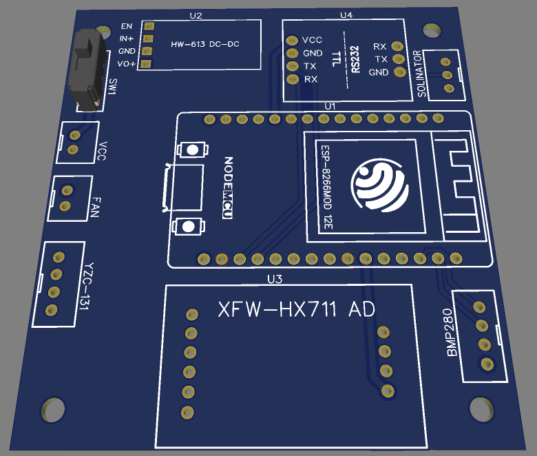
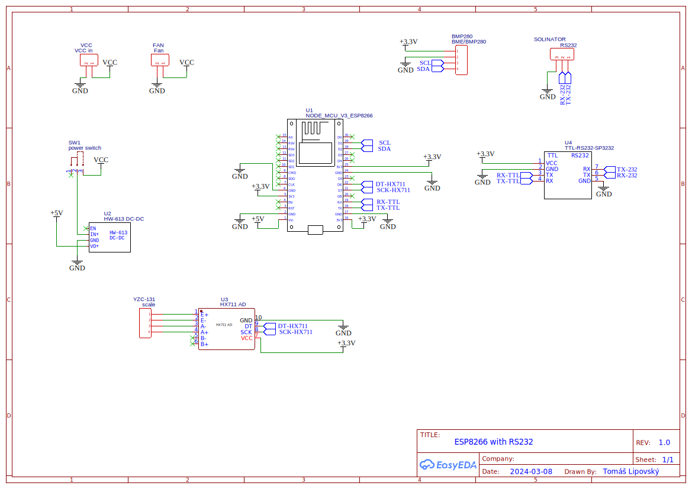
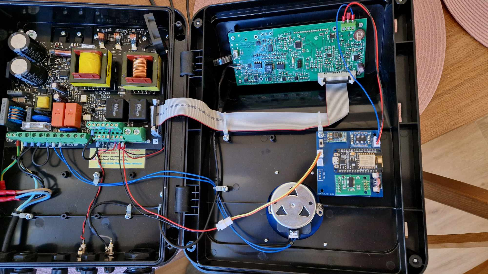
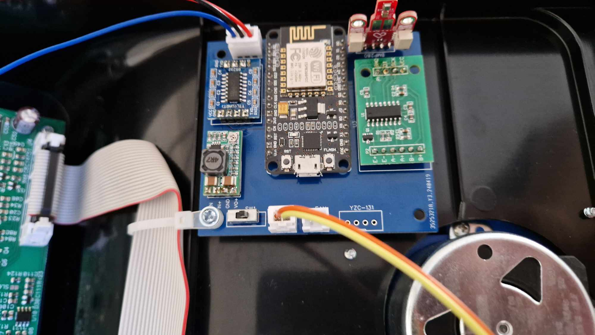

# PCB

You can order [PCB](https://oshwlab.com/lipov3cz3k/bspool-va-salt-smart-controller) from JLCPCB via EasyEDA editor.

Do not forget to set up DC-DC step-down to 5V output voltage!
Solinator is connected to the controller via RS232.
| Solinator | Controller |
|----------|------------|
| Right | Top |
| Middle | Middle |
| Left | Bottom |

# BOM

| Name                       | eshop                                                                                                                                                    |
| -------------------------- | -------------------------------------------------------------------------------------------------------------------------------------------------------- |
| ESP8266 Lua NodeMcu V3     | [laskakit](https://www.laskakit.cz/iot-esp8266-lua-nodemcu-v3-wifi-modul--tcp-ip/), [aliexpress](https://www.aliexpress.com/item/1005002768134300.html)  |
| Micro step-down DC-DC      | [laskakit](https://www.laskakit.cz/mikro-step-down-menic--nastavitelny/), [aliexpress](https://www.aliexpress.com/item/1005005393995240.html)            |
| ADC HX711                  | [laskakit](https://www.laskakit.cz/ad-prevodnik-modul-24-bit-2-kanaly-hx711/), [aliexpress](https://www.aliexpress.com/item/4000483062974.html)          |
| BMP280                     | [laskakit](https://www.laskakit.cz/laskakit-bmp280-senzor-tlaku-a-teploty-vzduchu/), [aliexpress](https://www.aliexpress.com/item/1005004515268706.html) |
| RS232 to TTL               | [aliexpress](https://www.aliexpress.com/item/1005006175976863.html)                                                                                      |
| YZC-131 20kg               | [laskakit](https://www.laskakit.cz/vazici-senzor-20kg-adc-modul-hx711/)                                                                                  |
| 2x JST-XH 2.5 connector 2p | [laskakit](https://www.laskakit.cz/jst-xh-2-54mm-konektor-do-dps/)                                                                                       |
| JST-XH 2.5 connector 3p    | [laskakit](https://www.laskakit.cz/jst-xh-2-54mm-konektor-do-dps/)                                                                                       |
| JST-XH 2.5 connector 4p    | [laskakit](https://www.laskakit.cz/jst-xh-2-54mm-konektor-do-dps/)                                                                                       |
| switch                     | [laskakit](https://www.laskakit.cz/posuvny-prepinac-0-3a-50vdc/)                                                                                         |
